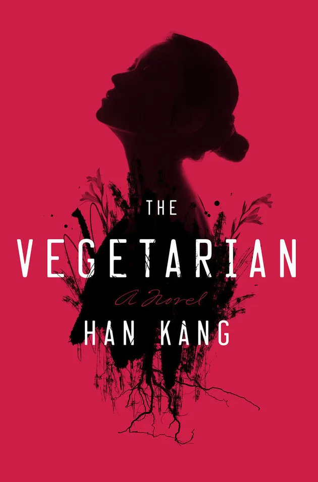

**Finished: _The Vegetarian_**  

I've recently completed _The Vegetarian_ by **Han Kang**, and it's an absolutely haunting and thought-provoking novel.  

**_Han Kang's_** storytelling is both lyrical and unsettling, weaving a psychological tale that explores themes of **identity, trauma, and the quiet rebellion against societal norms**.  

  

The novel follows **Yeong-hye**, a seemingly ordinary woman who makes the radical decision to stop eating meat after a series of disturbing dreams. What begins as a simple act of personal choice quickly spirals into a profound and tragic unraveling of her life, as those around her struggle to understand or accept her transformation.  

One of the most compelling aspects of _The Vegetarian_ is its **exploration of control, autonomy, and the human psyche**. **Han Kang’s** writing is both delicate and intense, immersing the reader in **Yeong-hye's** world while offering sharp social commentary on **gender, family, and the constraints of expectation**.  

As I reflect on this novel, I find myself deeply moved by its **stark, poetic prose** and the unsettling questions it raises about **identity and freedom**. It's a book that lingers in the mind long after the final page.  

If you're looking for a deeply introspective and beautifully written novel that **challenges conventions**, I highly recommend _The Vegetarian_.  
