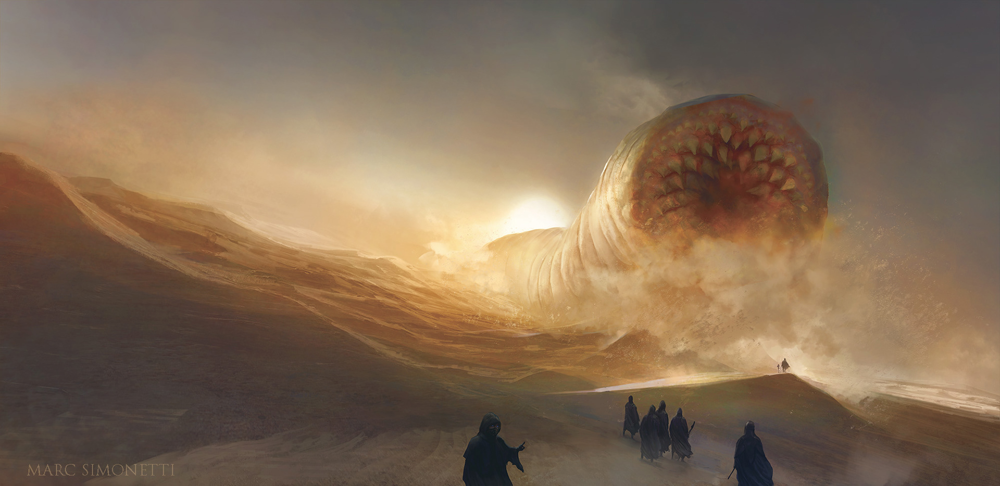

**Currently Reading: Dune**

I'm currently immersed in the captivating world of _Dune_ by Frank Herbert, and
I must say, it's absolutely fantastic.

_Dune_ is a masterful blend of science fiction, political intrigue, and timeless
philosophy. From the very first pages, Herbert's rich and intricate storytelling
draws you into a universe filled with fascinating characters, complex
relationships, and epic conflicts.

The desert planet of Arrakis, with its vast stretches of sand dunes and harsh
climate, serves as the backdrop for this gripping tale. As I journey through the
pages, I find myself completely enthralled by the vivid descriptions of Arrakis
and the intricacies of its indigenous culture.

One of the aspects that I find most compelling about _Dune_ is its exploration
of power, religion, and the human condition. Herbert's exploration of these
themes is thought-provoking and deeply insightful, prompting me to reflect on
the nature of leadership, belief systems, and the consequences of our actions.

As I continue my journey through the pages of _Dune_, I eagerly anticipate
uncovering the mysteries that lie ahead and delving deeper into the profound
questions it raises. With each chapter, I find myself more captivated by the
story and more invested in the fate of its characters.

If you haven't already experienced the wonder of _Dune_, I highly recommend
picking up a copy and embarking on this extraordinary adventure. It's a journey
that will stay with you long after you've turned the final page.
